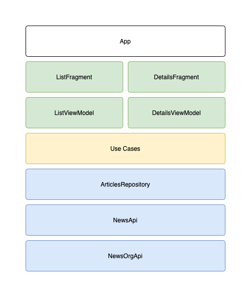

# News app

App source code is focused to show off scalable and testable architecture. App is divided into layers and features so each layer and feature could be developed by either dedicated team or a developer. Some interfaces might be excessive.




- two screens: list of news headlins, details screen
- basic offline (in memory) mode
- easy replacable third party libraries (`Picasso`)
- easy replacable api imlepementations (`newsapi.org`)
- tested data layer
- tested list viewmodel

## Setup
Create file `./news.api.org.config` with [newsapi.org](https://newsapi.org/) api key:

```properties
api.key=6c1f328d50c14011bb7aaecdea767e8c
```

## Test
```shell
./gradlew test
```

## Build
```
./gradlew clean assembleDebug
```